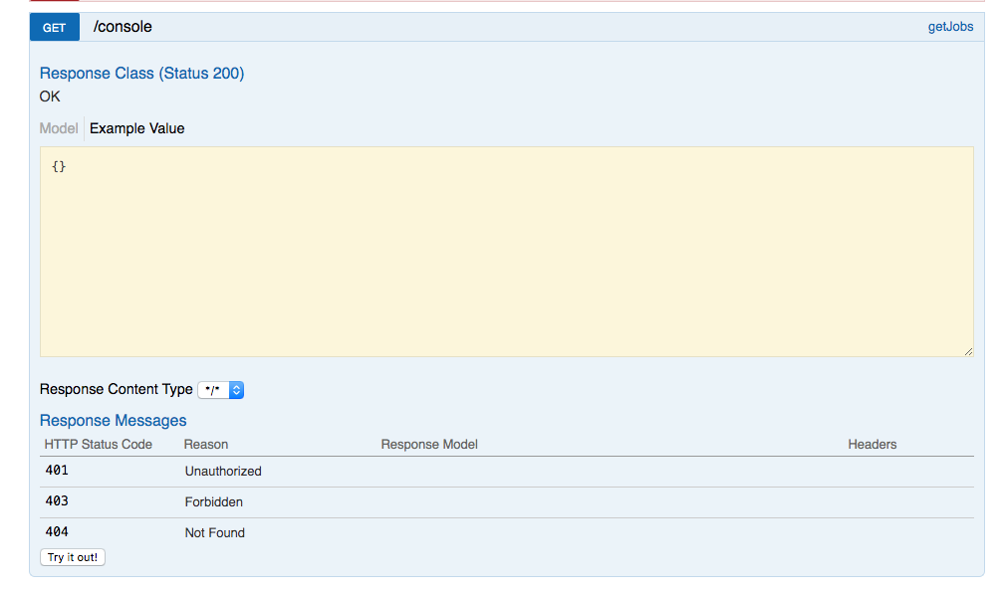
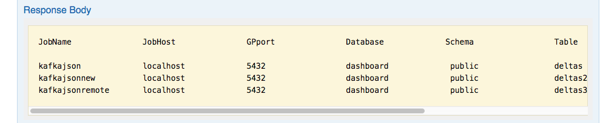
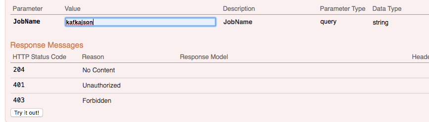
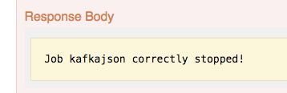
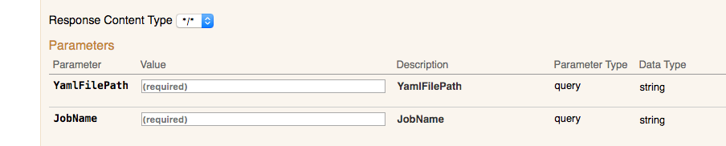

# gpss-console

This project serves as a demo to test the new gpss-grpc interface to manage gpsscli kafka jobs: </br>

https://gpdb.docs.pivotal.io/streaming-server/1-4/api/dev_client.html

To use it you need at least gpss 1.4 installed in your server.
The software is written in Java so it can run on every OS where java (7 or above) is installed.

### How to run the project:

In the bin directory of this project you will find the .jar developed. </br>

Go to properties.ini in the same folder and modify your gpsshost and gpssport to connect </br>

```
gpssHost=172.16.125.163
gpssPort=50009
```

Then load the .jar in following way also as for image </br>

java -jar gpssconsole-0.0.1-SNAPSHOT.jar


A web service will be spawned listening to port 8080

### Open a browser to port 8080 

click on controller and you should see something like this:

http://localhost:8080/swagger-ui.html#/


</br>


### test the apis

The software is developed as a rest api style (with some personalization)

GET: will list all the jobs in the grpcli (same as gpsscli list) </br>
PUT: Will submit a new job (gpss submit) </br>
POST: will start a job (gpss start) </br>
PATCH: will stop a job (gpss stop, sorry for this one but it was the last verb left) </br>
DELETE: will delete a job (gpss remove) </br>

### test the GET

To list all the jobs currectly submitted

Click on try it out!




### test the POST - PATCH - DELETE

To start, stop and delete a job. You need the job name




### test the PUT

To submit a job. In this case you need a yaml file (the same one you would use with gpsscli) and the name of the job




### Limitations

Still to be tested... api always return 200 even if an error occours (even tough the error is reported). 
Difference between gpsscli and grpc on list.
In gpsscli list will only list jobs started (not just submitted or stopped) while the grpc interface will list also the ones started or stopped...
